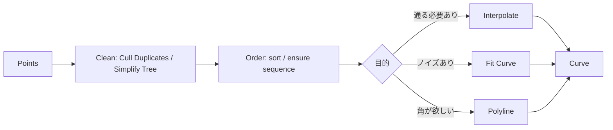

# アルゴリズム解説（主要機能の仕組みと選定基準）

Grasshopperでは、コンポーネントの選択によって結果が大きく変化します。本ページでは、**主要機能の仕組み（何を保証し、何を最適化しているか）**を、実務判断に必要な範囲で整理します。

- 目的: “暗記”ではなく、**選択理由**を説明できる状態にする
- 範囲: 実装の数式を網羅するのではなく、**挙動差が出る要点**に限定する

## 例題：点列からCurveを作る（選定基準とアルゴリズムの要点）

### 選定の結論（用途別の第一候補）

- **点が「必ず通過すべき条件」** → **Interpolate（補間）**
- **点が測定/スキャン等でノイズを含む** → **Fit Curve（近似）**
- **折れ線が欲しい（角を残したい）** → **Polyline**
- **「制御点（Control Points）を直接いじる」設計にしたい** → **Nurbs Curve（Control Points入力）**

### 事前に確定すべき3点

- **点の意味**: すべての点を通過させる必要があるか（補間）／誤差内で近似できるか（近似）
- **点の品質**: ノイズ（ばらつき）の有無、重複点の有無、順序の正しさ
- **欲しい曲線の性質**: 角を残す/滑らかにする、閉じる/開く、接線条件が必要か

## Interpolate（補間）：点列を通過する曲線を構成する

Grasshopperの `Interpolate` 系は、基本的に **NURBS曲線**を作ります。

- **保証**: 指定した点列を（原則）すべて通過する
- **注意**: 点が多い、または点列にノイズが含まれる場合、局所的な曲率の増大や振動（不要なうねり）が生じやすい

### アルゴリズムの要点（直感的な説明）

NURBS曲線の形状は、主に次の要素で決まります。

- **次数（degree）**: 滑らかさ（多くの場合3が扱いやすい）
- **ノット（knot / パラメータ化）**: 点列を曲線パラメータ上でどのような間隔として扱うか
- **制御点（control points）**: 曲線を規定する点（補間点そのものではない）

補間は「点列を通過するように、制御点（およびノット配置）を決定する」処理です。  
そのため、点列が乱れている場合、解が不安定になり振動が発生することがあります。

### 実務上の指針（安定化のための要点）

- **点の順序を保証する**（順序が不適切だと自己交差・蛇行の原因になる）
- **重複点を除去する**（同一点が連続すると不安定化しやすい）
- **過剰な点数を避ける**（必要以上の点は振動の原因になりやすい）
- **角を保持したい場合は補間に依存しない**（`Polyline` を基準に、必要箇所のみ `Fillet` / `Blend` を適用する方が制御しやすい）

## Fit Curve（近似）：誤差許容内で点列に近似する

`Fit Curve` 系は、点列を **誤差（許容値）以内**で近似する曲線を作ります。

- **保証**: すべての点を通過させるのではなく、許容誤差内で近似する
- **適用場面**: 点列がノイズを含む（測定/スキャン/サンプル等）
- **調整の要点**: 許容誤差を小さくすると補間に近づき、大きくすると滑らかになる一方、形状差も大きくなる

## Polyline（折れ線）：角を保持しつつ点列を接続する

角を保持したい場合は、`Polyline` を第一候補とするのが安全です。

- **保証**: 点を直線で結ぶ（挙動が明確）
- **後処理**: 必要に応じて局所的に `Fillet` / `Blend` / `Chamfer` を適用する

## 典型ワークフロー（点列→Curveを安定させる）

点列から曲線を生成する際の基本フローを示します。

## よくある失敗とチェックリスト

- **点の順序が不適切**（自己交差・蛇行が発生する）  
  - 対策: 点列の順序を作る工程を定義内に明示し、暗黙にListへ投入しない
- **重複点／過密点が混在**（局所で曲率が増大する）  
  - 対策: 重複除去、最小間隔の確保（必要に応じて間引き）
- **ノイズ点に対してInterpolateを適用**（不要な振動が発生する）  
  - 対策: `Fit Curve` へ切り替える、または点列を平滑化してから補間する
- **Data Tree構造の影響で意図しない曲線が複数生成される**  
  - 対策: `Simplify` / `Flatten` / `Graft` の方針を先に決め、後段で辻褄合わせをしない

