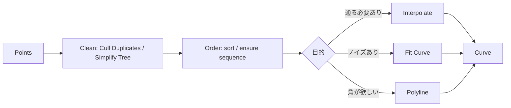

# アルゴリズム解説（主要機能の仕組みと選定基準）

Grasshopperでは、コンポーネントの選択によって結果が大きく変化します。本ページでは、**主要機能の仕組み（何を保証し、何を最適化しているか）**を、実務判断に必要な範囲で整理します。

- 目的: “暗記”ではなく、**選択理由**を説明できる状態にする
- 範囲: 実装の数式を網羅するのではなく、**挙動差が出る要点**に限定する

## 例題：点列からCurveを作る（選定基準とアルゴリズムの要点）

### 選定の結論（用途別の第一候補）

- **点が「必ず通過すべき条件」** → **Interpolate（補間）**
- **点が測定/スキャン等でノイズを含む** → **Fit Curve（近似）**
- **折れ線が欲しい（角を残したい）** → **Polyline**
- **「制御点（Control Points）を直接いじる」設計にしたい** → **Nurbs Curve（Control Points入力）**

### 事前に確定すべき3点

- **点の意味**: すべての点を通過させる必要があるか（補間）／誤差内で近似できるか（近似）
- **点の品質**: ノイズ（ばらつき）の有無、重複点の有無、順序の正しさ
- **欲しい曲線の性質**: 角を残す/滑らかにする、閉じる/開く、接線条件が必要か

## Interpolate（補間）：点列を通過する曲線を構成する

Grasshopperの `Interpolate` 系は、基本的に **NURBS曲線**を作ります。

- **保証**: 指定した点列を（原則）すべて通過する
- **注意**: 点が多い、または点列にノイズが含まれる場合、局所的な曲率の増大や振動（不要なうねり）が生じやすい

### Catmull-Romスプラインとの違い

「すべての点を通す曲線」としてCatmull-Romスプラインをイメージする場合がありますが、Grasshopperの `Interpolate` は異なるアプローチを採用しています。

**Catmull-Romスプラインの特徴**:
- 4点（\(P_{i-1}, P_i, P_{i+1}, P_{i+2}\)）を使って、\(P_i\) と \(P_{i+1}\) の間のセグメントを局所的に生成
- 通常は均等パラメータ化（uniform parameterization）を使用
- 端点の扱いが特殊（端点を通さない場合がある、または特別な処理が必要）

**Grasshopperの `Interpolate`（NURBS補間）の特徴**:
- 点列全体を一度に解いて、すべての点を通過する制御点とノット配置を決定
- デフォルトで弦長パラメータ化（chord length parameterization）を使用（点間距離を反映）
- 端点を必ず通過する
- 次数（degree）を変更可能（通常3）

**なぜNURBS補間を使うのか**:
- RhinoのジオメトリエンジンがNURBSを標準として扱うため、他のNURBS操作（ブーリアン、フィレット、サーフェス生成など）との互換性が高い
- パラメータ化の選択肢（弦長/均等）により、点間距離の影響を制御できる
- 次数を変更することで、滑らかさと局所的な制御のバランスを調整できる

### Catmull-Romスプラインを使いたい場合

Grasshopperの標準コンポーネントには、Catmull-Romスプラインを直接生成する機能はありません。Catmull-Romスプラインが必要な場合は、次の方法があります。

**方法1: Pythonスクリプトで実装する**

GrasshopperのPythonコンポーネントを使用して、RhinoCommonの`Curve.CreateCatmullRomSpline`メソッドを呼び出します。

```python
import Rhino.Geometry as rg

# inputs:
#   pts: Point3d[] (点列)

if pts and len(pts) >= 2:
    # Catmull-Romスプラインを生成
    # 端点を通す場合は closed=False
    crv = rg.Curve.CreateCatmullRomSpline(pts, closed=False)
    if crv:
        # outputs:
        #   crv: Curve
        a = crv
    else:
        a = None
else:
    a = None
```

**方法2: Interpolateで近似する**

`Interpolate`コンポーネントで均等パラメータ化（uniform parameterization）を指定すると、Catmull-Romスプラインに近い挙動になります。ただし、完全に同じにはなりません。

- `Interpolate`コンポーネントのパラメータ化オプションを「Uniform」に設定
- 点列が均等間隔に近い場合、結果がCatmull-Romに近づく

**方法3: プラグインを探す**

GrasshopperのコミュニティプラグインにCatmull-Romスプラインを提供するものがある可能性があります。ただし、標準機能ではないため、プラグインのメンテナンス状況や互換性を確認する必要があります。

**Catmull-Romが必要な場面**:
- アニメーション/ゲーム開発で、既存のパイプラインと互換性が必要
- 局所的な4点補間の挙動が設計要件に合致している
- 均等パラメータ化による予測可能な挙動が必要

### アルゴリズムの要点：なぜ制御点で補間点を通せるのか

NURBS曲線は**制御点（control points）**で定義されますが、制御点は通常補間点とは異なる位置にあります。では、なぜ補間点を通る曲線を作れるのでしょうか。

**補間の仕組み（逆算問題）**:

1. **制御点の数と補間点の数の関係**
   - 次数3のNURBS曲線でn個の補間点を通るには、通常**n個の制御点**が必要です
   - 補間点の数と制御点の数は**1対1対応**します（n個の補間点 → n個の制御点）
   - ただし、制御点は補間点の「単純な関数」p = f(v) ではなく、**線形システムとして解く**必要があります

2. **連立方程式として解く（線形システム）**
   - 各補間点\(V_i\)について、「NURBS曲線の式にパラメータ\(u_i\)を代入した結果が\(V_i\)になる」という条件を立てます
   - NURBS曲線の式:
     \[
     C(u) = \sum_{j} N_{j,p}(u) \cdot P_j
     \]
     （\(P_j\)は制御点、\(N_{j,p}(u)\)は基底関数）
   - 各補間点\(V_i\)について:
     \[
     V_i = \sum_{j} N_{j,p}(u_i) \cdot P_j
     \]
   - これにより、\(n\)個の補間点から\(n\)個の方程式ができます
   - 未知数は制御点の座標（\(n\)個×3次元 = \(3n\)個）です
   - ノットベクトル（knot vector）を先に決めれば、基底関数\(N_{j,p}(u_i)\)が確定し、**線形システム \(A \cdot P = V\)** として解けます
     - \(A\): \(n \times n\)行列（基底関数の値で構成）
     - \(P\): \(n \times 3\)行列（制御点の座標）
     - \(V\): \(n \times 3\)行列（補間点の座標）

3. **1対1対応だが、単純な関数ではない**
   - 補間点\(V_i\)と制御点\(P_j\)は1対1対応しますが、\(P_j = f(V_j)\) という単純な関数関係ではありません
   - 各制御点\(P_j\)は、**すべての補間点\(V_1, V_2, \ldots, V_n\)**の情報を使って決定されます
   - つまり、次の形になり、各制御点は全補間点の線形結合です:
     \[
     P_j = \sum_{i} A^{-1}_{j,i} \cdot V_i
     \]
     （\(A^{-1}\)は逆行列）

4. **微分可能性**
   - 補間点\(V\)から制御点\(P\)への写像は**線形写像**（\(P = A^{-1} \cdot V\)）なので、**微分可能**です
   - ノットベクトルが固定されている場合、\(A\)は定数行列なので、\(P = A^{-1} \cdot V\) は線形で、微分は定数行列\(A^{-1}\)になります
   - ノットベクトルも補間点に依存する場合（弦長パラメータ化など）、非線形になりますが、それでも**微分可能**です
   - NURBS曲線\(C(u)\)自体も、パラメータ\(u\)について**無限回微分可能**です（次数3の場合、\(C^2\)連続が保証されます）

5. **制御点から補間点への逆方向の計算**
   - **制御点\(P_j\)がわかれば、補間点\(V_i\)は原理的に計算可能**です
   - 補間点\(V_i\)は、パラメータ値\(u_i\)でNURBS曲線を評価した結果:
     \[
     V_i = C(u_i) = \sum_{j} N_{j,p}(u_i) \cdot P_j
     \]
   - これは**単純な計算**で、連立方程式を解く必要はありません（基底関数\(N_{j,p}(u_i)\)の値と制御点\(P_j\)の線形結合を計算するだけ）
   - ただし、**どのパラメータ値\(u_i\)で評価するか**を決める必要があります（元の補間問題で使ったノットベクトル/パラメータ化を覚えておく必要がある）
   - **非対称性**: 補間点→制御点は連立方程式を解く必要があるが、制御点→補間点は単純な評価計算で済む

6. **ノットベクトルの決定**
   - ノットベクトルは、各補間点に対応するパラメータ値\(u_i\)を定義します
   - 弦長パラメータ化: \(u_i\)は累積弦長に比例（点間距離を反映）
   - 均等パラメータ化: \(u_i\)は均等に割り当て（\(0, \frac{1}{n-1}, \frac{2}{n-1}, \ldots, 1\)）
   - ノットベクトルが決まると、基底関数\(N_{i,p}(u)\)が確定し、連立方程式が解けます

7. **端点条件の扱い**
   - 開いた曲線の場合、端点を必ず通すように制約を追加します
   - 閉じた曲線の場合、最初と最後の点を一致させます

**なぜ振動が起きるのか**:
- 補間点が不規則に配置されている場合、ノットベクトルと補間点の対応が不自然になり、基底関数の組み合わせで大きな係数が発生することがあります
- これにより、制御点が補間点から大きく外れた位置に配置され、曲線が「暴れる」ことがあります

**N個の補間点で生成されるNURBS曲線の構造**:

N個の補間点が与えられた場合、**1本のNURBS曲線**が生成されます。ただし、この曲線は内部的に複数のセグメント（区間）で構成されています。

- **セグメント数**: 次数3の場合、\(n\)個の補間点に対して**\(n-3\)個のセグメント**が生成されます
  - 例: 10個の補間点 → 7個のセグメント
  - 例: 1000個の補間点 → 997個のセグメント
  - 各セグメントは、隣接するセグメントとC²連続（曲率連続）で接続されます
- **セグメント数の計算式**: セグメント数 = 補間点数 - 次数
  - これは、ノットベクトルの構造（端点に次数+1個の重複ノット、内部に\(n-\text{次数}-1\)個のノット）から導かれます
- **1本の曲線として扱われる**: セグメントは内部的に分割されていますが、外部的には1本の連続したNURBS曲線として扱われます
  - `Divide Curve`で分割したり、`Evaluate Curve`で任意のパラメータ値を評価したりできます
- **セグメント境界**: セグメントの境界は、ノットベクトル内の「重複ノット」の位置に対応します
  - 次数3の場合、ノットベクトルは通常 \([0,0,0,0, u_1, u_2, \ldots, u_{n-3}, 1,1,1,1]\) の形式になります
  - 端点（0と1）には次数+1個の重複ノットがあり、内部ノットは補間点に対応します

**なぜセグメント化されるのか**:
- 各セグメントは局所的に制御可能です（局所的な変更が他の部分に影響しにくい）
- しかし、次数が高い場合や補間点が多い場合、1本の長い曲線として扱う方が効率的です
- セグメント境界は、補間点の位置とノットベクトルの構造から自動的に決まります

**NURBS曲線の形状を決める要素**:

- **次数（degree）**: 滑らかさ（多くの場合3が扱いやすい）
  - 次数が高いほど滑らかだが、制御が難しくなる
  - 次数3の場合、各セグメントは3次多項式で表現されます
- **ノット（knot / パラメータ化）**: 点列を曲線パラメータ上でどのような間隔として扱うか
  - 弦長パラメータ化: 点間の実際の距離を反映（点が密な箇所はパラメータ間隔が狭い）
  - 均等パラメータ化: 点間の距離に関係なく均等にパラメータを割り当て
  - ノットベクトルの構造がセグメント境界を決定します
- **制御点（control points）**: 曲線を規定する点（補間点そのものではない）
  - 補間の場合、制御点は補間点を通るように逆算で決定される
  - 制御点は補間点から離れた位置にあることが多い（特に点が不規則な場合）
  - 制御点の数は、補間点の数と次数から決まります（通常、補間点数と同じ）

### 実務上の指針（安定化のための要点）

- **点の順序を保証する**（順序が不適切だと自己交差・蛇行の原因になる）
- **重複点を除去する**（同一点が連続すると不安定化しやすい）
- **過剰な点数を避ける**（必要以上の点は振動の原因になりやすい）
- **角を保持したい場合は補間に依存しない**（`Polyline` を基準に、必要箇所のみ `Fillet` / `Blend` を適用する方が制御しやすい）

## Fit Curve（近似）：誤差許容内で点列に近似する

`Fit Curve` 系は、点列を **誤差（許容値）以内**で近似する曲線を作ります。

- **保証**: すべての点を通過させるのではなく、許容誤差内で近似する
- **適用場面**: 点列がノイズを含む（測定/スキャン/サンプル等）
- **調整の要点**: 許容誤差を小さくすると補間に近づき、大きくすると滑らかになる一方、形状差も大きくなる

## Polyline（折れ線）：角を保持しつつ点列を接続する

角を保持したい場合は、`Polyline` を第一候補とするのが安全です。

- **保証**: 点を直線で結ぶ（挙動が明確）
- **後処理**: 必要に応じて局所的に `Fillet` / `Blend` / `Chamfer` を適用する

## 典型ワークフロー（点列→Curveを安定させる）

点列から曲線を生成する際の基本フローを示します。



## よくある失敗とチェックリスト

- **点の順序が不適切**（自己交差・蛇行が発生する）  
  - 対策: 点列の順序を作る工程を定義内に明示し、暗黙にListへ投入しない
- **重複点／過密点が混在**（局所で曲率が増大する）  
  - 対策: 重複除去、最小間隔の確保（必要に応じて間引き）
- **ノイズ点に対してInterpolateを適用**（不要な振動が発生する）  
  - 対策: `Fit Curve` へ切り替える、または点列を平滑化してから補間する
- **Data Tree構造の影響で意図しない曲線が複数生成される**  
  - 対策: `Simplify` / `Flatten` / `Graft` の方針を先に決め、後段で辻褄合わせをしない

