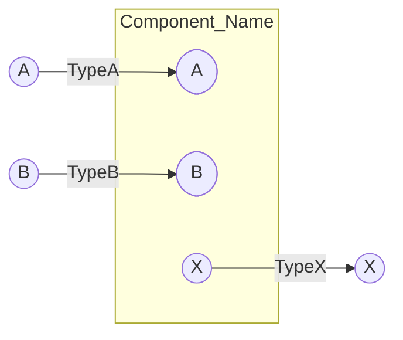
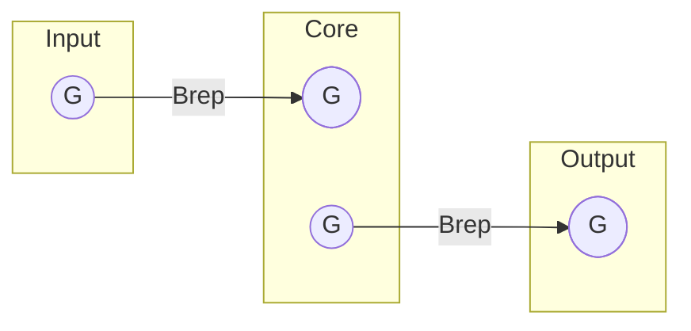
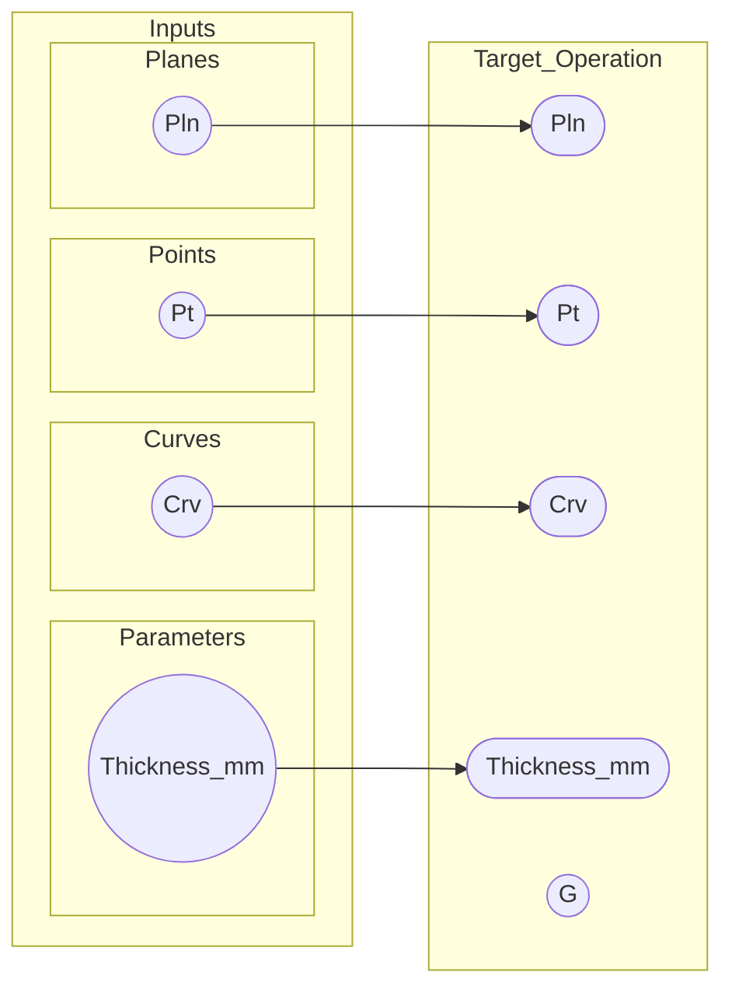
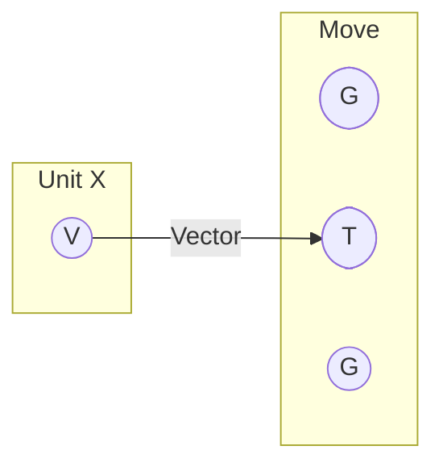

---
order: 40
---

# MermaidによるGrasshopper（GH）配線図の作成

Q: Mermaidを使用してGrasshopperの配線図を記述する目的と、基本的なルールは何ですか？

A: 本ドキュメントの目的は、GHのキャンバスを画像として貼るのではなく、**テキストベース（Mermaid）で再編集可能な「読める配線図」**を効率的に作成することです。

- **描画方向**: `flowchart LR`（左から右）を推奨します。GHの「左入力→右出力」の基本ルールに一致します。
- **抽象度**: すべてのポートを網羅するのではなく、**データの流れ、重要な型（Point, Curve等）、およびパラメータ**が伝わる程度の抽象度を優先します。

## 構成要素の表現仕様と命名規則

Q: コンポーネント、ポート、配線、およびグループはどのように記述すればよいですか？

A: 以下の表現ルールに従うことで、統一感のある図を作成できます。

- **コンポーネント**: `subgraph` で囲み、ラベルにコンポーネント名を記述します。
- **ポート**: `subgraph` の内部に配置する小さなノードとして表現します。
  - **入力ポート**: `([T])`（角丸）
  - **出力ポート**: `((G))`（丸）
- **ノードIDの命名**: スペースを含まない英数字（例: `comp_Move`, `in_T`）をIDとし、表示ラベルは `["表示名"]` で別途指定します。
- **配線**: ポート間を `-->` で結びます。必要に応じて `-->|Number|` のように矢印の上に型情報を記載します（エッジラベル内の `"` は環境によってパースエラーになるため避けます）。
- **グループ**: 関連する複数のコンポーネントをさらに大きな `subgraph` で囲み、処理の意図（例: "Generate Base Points"）をラベルにします。

## コピペ用テンプレートと実例

Q: すぐに使える最小構成のテンプレートと、実用的な記述例を教えてください。

A: 以下のコードをコピーして、コンポーネント名やポートIDを書き換えて使用してください。

### 最小構成テンプレート


### グループ化を含む実例
```mermaid
flowchart LR
  subgraph group_Gen["点列生成"]
    subgraph comp_Slider["Slider"]
      out_S((N))
    end
    subgraph comp_Grid["Square Grid"]
      in_G_n([N])
      out_G_p((P))
    end
  end

  subgraph group_Post["後処理"]
    subgraph comp_Move["Move"]
      in_M_g([G])
      in_M_t([T])
    end
  end

  out_S -->|Int| in_G_n
  out_G_p -->|Point[]| in_M_g
```

## コンポーネント解説用テンプレ（GHキャンバス風）

Q: 「コンポーネントの説明」に使う場合、どの程度まで配線図を細かく書くべきですか？

A: スクリーンショットの代替ではなく、**説明したい挙動差が出る入力/出力（と型）だけを描く**のを基本にします。
迷ったら、1つのQ&Aに対して **1図**（多くても3図）に絞ってください。

### テンプレ1：単一コンポーネント（入力→出力）



### テンプレ2：小さなパイプライン（3〜5コンポーネント）



### テンプレ3：Inputs集約（左端に整理する）



## 執筆時のヒントと注意点

Q: Mermaidで配線図を作成する際に、よくある失敗や気をつけるべき点はありますか？

A: 以下の3点に注意することで、メンテナンス性の高い図を維持できます。

1. **IDにスペースを含めない**: IDにスペースや特殊記号が含まれると、Mermaidのレンダリングが壊れる原因になります。
2. **見た目を作り込みすぎない**: 配線が複雑になりすぎる場合は、無理に1つの図にまとめず、処理フェーズごとに図を分けることを検討してください。
3. **型情報を重視する**: 図を見る人が「今何が流れているか（1つの点か、リストか）」を把握できるように、配線のラベルを活用してください。

## 見た目をGHに寄せるコツ

Q: MermaidでGHっぽい見た目に寄せるには？

A: 作り込みすぎず、最低限の「視認性」と「統一感」を狙います。

- **方向**: 迷ったら `flowchart LR`（左→右）
- **ラベル**: コンポーネント名は短く、型はエッジラベルで補う（例: `-->|Point[]|`）
- **スタイル**: **色指定やスタイル指定には頼らず**、形（角丸/丸）とラベルで判別できる状態を基本にします。



