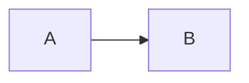

# Mermaidで作るGrasshopper（GH）配線図

このページでは、VitePress上で **Mermaid** を使って「Grasshopperのコンポーネント配線図」を描くための **表現ルール（仕様）** と **コピペ用テンプレ** をまとめます。

## 基本方針

**Q: MermaidでGH配線図を描く目的は？**

A: GHのキャンバスを完全再現するのではなく、**ドキュメントとして読める配線図**を効率的に作成することを目的とします。**コンポーネント**、**入力/出力ポート**、**配線**、**グループ**を表現でき、図の意味（データの流れ・型・重要なパラメータ）が伝わることを優先します。

## 記法の基本

**Q: Mermaidの基本的な書き方は？**

A: Mermaidはコードフェンスで書きます：



**Q: 推奨する方向は？**

A: `flowchart LR`（左→右）を推奨します。GHの「左入力→右出力」に合わせやすいです。

## 命名規約

**Q: ノード名（ID）の命名規則は？**

A: MermaidのID（ノード名）は **スペース無し**が安全です。英数字＋`_`を推奨します。

- **OK**: `comp_Move`, `in_T`, `out_Geo`, `group_Main`
- **NG**: `Move Component`, `入力 T`

表示名（ラベル）は日本語でもOKです（`["表示名"]`）。

## 表現仕様

**Q: コンポーネントはどう表現しますか？**

A: コンポーネントは `subgraph` で表現します。`subgraph` のラベルに **コンポーネント名**を入れます。

**Q: 入力/出力ポートはどう表現しますか？**

A: ポートは `subgraph` の中に **小ノードとして置く**（これが「拘束」になる）ことで表現します。形で区別します（最小構成）：
- **入力ポート**: `([T])`（角丸っぽい見た目）
- **出力ポート**: `((G))`（丸っぽい見た目）

ポートIDは `in_...` / `out_...` を推奨します。

**Q: 配線はどう表現しますか？**

A: 配線はポート同士を結びます: `out_X --> in_Y`。可能なら **型・意味**をラベルに入れます: `-->|"Number"|`

**Q: グループ（GHのGroup）はどう表現しますか？**

A: GHのGroupは、複数コンポーネントを `subgraph` で囲みます。グループのラベルに **意図（目的）**を書くと読みやすいです。

## コピペ用テンプレ

**Q: 最小構成のテンプレは？**

A: 以下をベースに、コンポーネントとポートを増やしていきます。

```mermaid
flowchart LR
  %% ===== Components =====
  subgraph comp_A["Number Slider"]
    in_A_min([Min])
    in_A_max([Max])
    out_A_n((N))
  end

  subgraph comp_B["Move"]
    in_B_g([G])
    in_B_t([T])
    out_B_g((G))
  end

  %% ===== Wires =====
  out_A_n -->| "Number" | in_B_t
```

## 実例

**Q: ポート付きの基本形の例は？**

A: 以下のような形になります。

```mermaid
flowchart LR
  subgraph comp_Crv["Curve"]
    out_Crv((Crv))
  end

  subgraph comp_Div["Divide Curve"]
    in_Div_crv([C])
    in_Div_n([N])
    out_Div_pts((P))
  end

  subgraph comp_Pt["Point"]
    in_Pt_p([P])
  end

  out_Crv -->| "Curve" | in_Div_crv
  out_Div_pts -->| "Point[]" | in_Pt_p
```

**Q: グループ（処理のまとまり）を作る例は？**

A: 以下のような形になります。

```mermaid
flowchart LR
  subgraph group_Gen["Generate base points"]
    subgraph comp_Slider["Slider"]
      out_Slider((N))
    end

    subgraph comp_Grid["Square Grid"]
      in_Grid_n([N])
      out_Grid_pts((P))
    end
  end

  subgraph group_Post["Post-process"]
    subgraph comp_Move["Move"]
      in_Move_g([G])
      in_Move_t([T])
      out_Move_g((G))
    end
  end

  out_Slider -->| "Int" | in_Grid_n
  out_Grid_pts -->| "Point[]" | in_Move_g
```

## よくある落とし穴

**Q: よくある失敗は？**

A: 以下に注意します：
- **ノードIDにスペース**を入れると壊れやすい（特に `subgraph` の中）
- 「ポート同士だけ結ぶ」形にしてから、必要ならラベルを追加するとデバッグが容易になる
- 見た目を作り込みすぎるより、**型（Number/Point/Curve/Brep…）**と**責務（何をしてるか）**が伝わる方が重要
