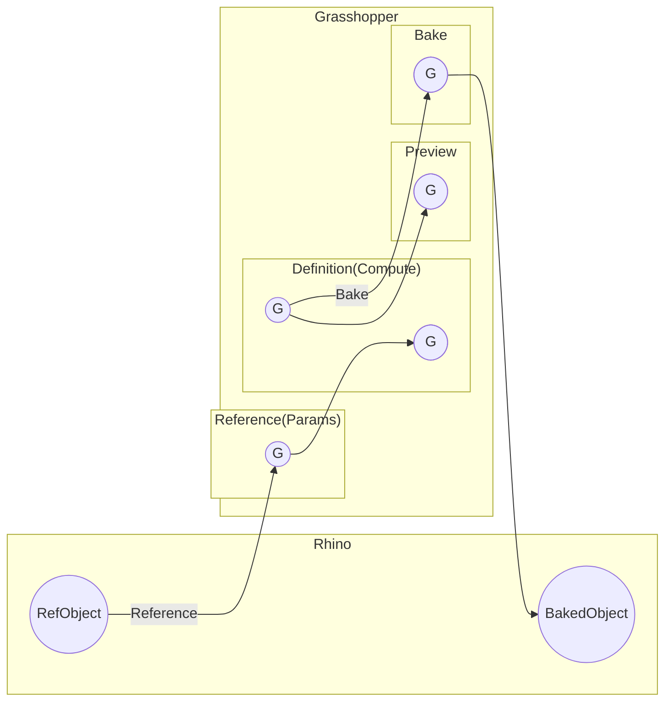
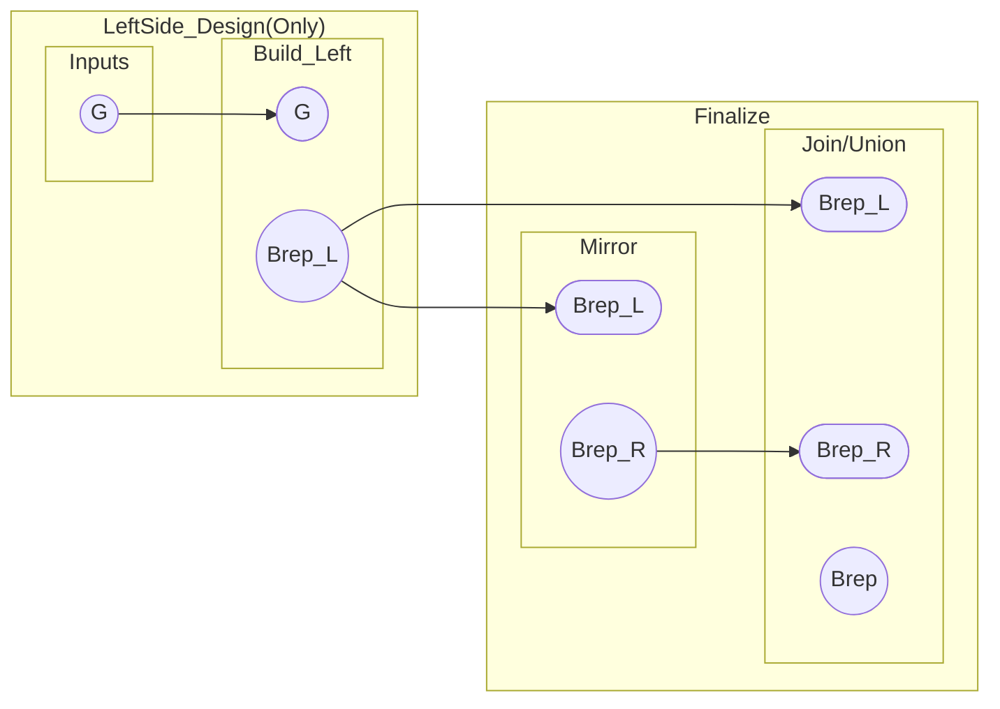

# Grasshopperの「履歴」と後編集（壊れにくい作り方）

このページは、Grasshopperを「後から直せる状態」で運用するための最小前提をまとめます。

- **このページでわかること**: 「履歴」の意味 / ReferenceとBakeの使い分け / 壊れにくい入力設計 / 対称モデルの作法
- **前提**: Rhino上の参照オブジェクトは **動かせるが壊れやすい**（トポロジ変化・インデックス参照が特に危険）

**Q: Grasshopperにおける「履歴（History）」とは何ですか？また、RhinoのHistory機能とはどう違うのですか？**

**A:** Grasshopperの履歴とは、**データフロー（入力→計算→出力）そのものを保存した定義ファイル（.gh/.ghx）**を指します。

- **性質**: パラメータを変更すると、自動的に計算結果が更新されます。
- **Rhino Historyとの違い**: RhinoのHistoryは「操作の連鎖（コマンドの履歴）」を記録するものですが、Grasshopperは「造形の論理構造」そのものを構築します。
- **運用のコツ**: 「後から調整したい箇所」を意図的に入力パラメータ（スライダー等）として設計することが、Grasshopperにおける「履歴を残す」ことに相当します。基本的にはGrasshopperを主履歴とし、RhinoのHistoryは補助的に使用するのが安定します。

## 参照とベイク：Rhinoとのデータ連携

**Q: Rhino上のオブジェクトをGrasshopperで扱う際の「参照（Reference）」と「ベイク（Bake）」の使い分けを教えてください。**

**A:** データの「動的リンク」か「静的固定」かの違いで使い分けます。

- **参照 (Reference)**: Rhino上のオブジェクトをGHの入力として紐付けます。Rhino側を動かせばGHも即座に更新されますが、面の数や順序（トポロジ）が変わると後段の計算が壊れやすいため注意が必要です。
- **ベイク (Bake)**: GHの計算結果をRhino上の実体オブジェクトとして書き出します。この瞬間にGHとのリンクは切れます。「造形の骨組みはGHで作るが、最終的な細かい手直しはRhinoで行う」といった、作業の切り替え地点として活用します。

## 後編集に強い（壊れにくい）パラメータ設計

**Q: 形状の変更に柔軟に対応できる、堅牢な定義を作るためのポイントは何ですか？**

**A:** 以下の優先順位で入力を設計することを推奨します。

1. **数値的な制御（推奨）**: 厚み、オフセット量、角度、分割数など。最も安定します。
2. **基準による制御（推奨）**: 正中面、目の高さの平面、ランドマーク点など。「○番目の点」といったインデックス指定ではなく、空間的な基準に寄せます。
3. **曲線による制御**: 断面曲線やガイドライン。これらを動かして形状を生成するように組みます。
4. **トポロジ依存の回避（非推奨）**: 「面の○番目のエッジ」といった参照は、元の形が少し変わるだけで番号が入れ替わり、定義が崩壊する原因になります。

## 左右対称（鏡像）デザインの作法

**Q: 左右対称なモデルを効率的に作成し、かつ後から編集しやすくする手法は？**

**A:** **「片側のみを設計し、最後にミラーする」** ワークフローを徹底してください。

- **理由**: 制御点や断面曲線が半分で済むため、左右の整合性を気にする必要がなく、編集効率が劇的に向上します。
- **正中の処理**: 左右を単純に繋ぐと正中で面が重なったり隙間ができたりするため、少しオーバーラップさせてからブーリアン結合するか、正中面上の点に `Set PT` 等で拘束をかけるのが一般的です。
- **非対称の追加**: 最後に左右で異なる形状を入れたい場合は、ミラーした後の最終段で「右側だけに差分を加える」ように設計します。

## 実装チェックリスト

**Q: 自分の作成した定義が「後編集に強い状態」かを確認するための基準はありますか？**

**A:** 以下の5項目をセルフチェックしてください。

- **入力の集約**: スライダーや参照元が一箇所にグループ化されているか。
- **インデックス指定の排除**: リストの番号（Item Index）でジオメトリを特定していないか。
- **ベイク地点の明確化**: どこまでをGHで自動化し、どこから手動作業にするか決まっているか。
- **ミラーのタイミング**: 対称モデルの場合、無駄に両側を個別に作っていないか。
- **正中のクリーンアップ**: ミラー後の接合部で面が重複したり、不要なエッジが残ったりしていないか。

## 次に読む

- **入力設計を具体化**: [パラメータ設計（壊れにくい入力の作り方）](/grasshopper/parameter-design)
- **参照メッシュから再構築**: [参照メッシュからNURBS/Brepへ再構築（Grasshopperの"壊れにくい型"）](/grasshopper/mesh-reference-to-brep-rebuild)
