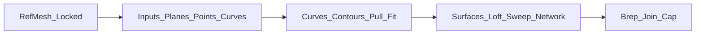

# 参照メッシュからNURBS/Brepへ再構築（Grasshopperの"壊れにくい型"）

## 基本概念

**Q: このワークフローの目的は？**

A: Blender等から来たメッシュを **参照** しながら、Grasshopperで **パラメトリックに組み直して**、最終的に **NURBS/Brep** にするワークフローです。ポイントは、メッシュをそのままNURBS化するのではなく、いったん **基準・ランドマーク・断面曲線**に落としてから面を作ることです。

> Blender→Rhinoの受け渡し（参照メッシュの作り方）: `../rhino/blender-mesh-to-rhino.md`  
> 「トポロジ依存が壊れる」注意: `history-and-editing.md` / `parameter-design.md`

**Q: 全体の基本原則は？**

A: 以下の流れで進めます：

- **RefMeshは固定**（置き換えるなら"同じ意味の参照"にする）
- **Inputsをトポロジ非依存**にする（番号参照を避ける）
- **曲線で設計し、面は結果**にする（面を直接いじらない）

## 参照メッシュの安定化

**Q: Grasshopperが壊れる典型的な原因は？**

A: 以下の2つが典型的です：
- 参照元メッシュの **面分割/頂点数が変わった**
- 参照を "面の0番目""エッジの3番目" のように **番号で掴んでいた**

**Q: 対策は？**

A: 以下を実施します：
- Rhino側で参照メッシュを `Lock`（`../rhino/blender-mesh-to-rhino.md` の「参照として固定」）
- GH側は **基準平面・ランドマーク点・断面曲線** で入力を持つ（番号依存をしない）

## 入力（Inputs）の設計

**Q: 最小セットの入力は？**

A: 以下の3種類を推奨します：

### 基準（Planes）

- 正中面（対称にしたいなら必須）
- 高さ基準面（例: 目の高さ、口の高さ）
- 前後基準面（奥行きの位置決め）

### ランドマーク（Points）

"後で位置を調整したい点"を入力にします。

- 例: 鼻先、瞳中心、口角、顎先、耳付け根 など

**Q: ランドマーク点の作成方法は？**

A: Rhino上に点を置いて、GHの `Point` パラメータで参照します。後から点を動かせる＝パラメータ化できます。

### 断面（Curves / Section Planes）

形を決める主役です。

- 正中プロファイル（横顔の基準）
- 複数の横断面（Contour）
- 必要なら縦断面（頬・鼻翼など局所）

## 参照メッシュから曲線を取る

**Q: トポロジ非依存で曲線を取る方法は？**

A: 以下の方法があります（コンポーネント名は環境で多少違っても、カテゴリで辿れます）：

### A) Contour（一定間隔の断面）

- `Contour`（CurveカテゴリのUtil系）
  - 入力: Mesh（参照メッシュ）, Plane, Distance

**Q: Contourの運用上の注意は？**

A: 以下に注意します：
- 距離は「後で変える入力」にする（断面密度をパラメトリックに調整できる）
- 必要な場所は "一定間隔" ではなく、**任意の断面平面を入力**にする方が設計が安定します

### B) Mesh × Plane（任意平面で切る）

- MeshとPlaneの交線を出す系（Intersectカテゴリにあります）

**Q: 用途は？**

A: 目の高さ/口の高さなど「意味のある平面」で断面を取る場合に使用します。

### C) Pull / Project（ガイド曲線をメッシュへ吸着）

- `Pull Curve` / `Project` の系

**Q: 用途は？**

A: "この線はここを通ってほしい"というデザイン意図を、参照メッシュに寄せたい時に使用します。

## 曲線の整え方

**Q: 参照から取った曲線を整える方法は？**

A: 参照から取った曲線は、そのままだとノイズが多いことが多いです。一般的な整え方：

- `Simplify`（データ構造を単純化）
- `Rebuild Curve`（制御点数を揃える）
- `Fit Curve`（誤差許容で滑らかに近似）
- `Smooth`（必要なら）

**Q: 整える際の指針は？**

A: 以下を優先します：
- "見た目"より **後段が壊れない**（曲線が暴れない/接線が破綻しない）を優先
- 断面曲線群は、可能なら **同じ制御点数/同じ向き**に揃える（Loftが安定する）

## 曲線からサーフェスを作る

**Q: 目的別のサーフェス作成方法は？**

A: 以下の方法があります：

### A) Loft（断面が並んでいるとき）

- `Loft`

**Q: 向いている形状は？**

A: 横断面が順序よく並ぶ形状（外装全体など）に適しています。

### B) Sweep2（レールが明確なとき）

- `Sweep2`（2レールスイープ）

**Q: 向いている形状は？**

A: 輪郭レール＋断面、のように"流れ"が明確な形状に適しています。

### C) NetworkSrf（交差する曲線網が作れるとき）

- `Network Surface`

**Q: 向いている形状は？**

A: 縦/横の曲線が交差する"面の骨格"を作れる場合に適しています。

### D) Patch（最後の手段として）

- `Patch`

**Q: 注意点は？**

A: 設計意図が"面の近似"になりやすいので、ランドマークや境界曲線で強く拘束する必要があります。

## Brep化

**Q: Brep化の方法は？**

A: 最後に「ソリッドとして成立」させます。

- `Join Brep`
- 必要なら `Cap Holes`（閉じられる穴だけを閉じる）

> ここで失敗する場合は、曲線の段階（隙間/向き/交差）に戻って修正する方が効率的です。

## 後から変えられる設計

**Q: "後から変えられる"設計にするための最低限の作法は？**

A: 以下を実施します：
- 定義の左側に Inputs を集める（基準平面/ランドマーク/断面/数値）
- "番号で拾う"参照を避ける（List ItemやTreeのインデックスに依存しない）
- ベイク地点を意図的に決める（どこまでGHで管理するか）

> 関連: `history-and-editing.md`

## 次にやること

- 参照メッシュの受け渡し（Blender→Rhino）を詰める: `../rhino/blender-mesh-to-rhino.md`
- 受け渡し形式の相性（STEP/IGES/STL/3MF）: `../rhino/subd-cad-interoperability-and-formats.md`
