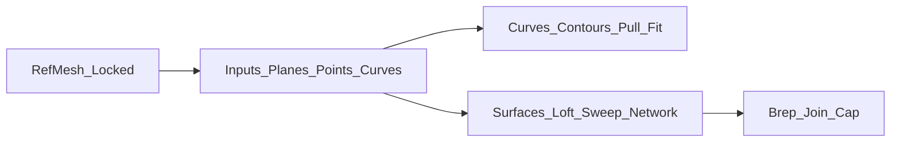

# 参照メッシュからNURBS/Brepへ再構築（Grasshopperの"壊れにくい型"）

## 基本概念

Q: 既存のメッシュデータ（参照メッシュ）をガイドにして、GrasshopperでNURBS/Brepとして再構築するワークフローの目的は何ですか？

A: Blender等で作成された自由なメッシュ形状を **「参照（リファレンス）」** としつつ、Grasshopperで **「数学的にクリーンで編集可能なパラメトリックモデル」** として組み直すことが目的です。メッシュをそのまま変換するのではなく、いったん **基準・ランドマーク・断面曲線** という幾何学的な要素に分解して再構築することで、精密な肉厚設定や製造用CADへの統合が可能になります。

> 関連情報:
> - Blender→Rhinoの受け渡し: `../rhino/blender-mesh-to-rhino.md`  
> - 編集の基本方針: `history-and-editing.md` / `parameter-design.md`

Q: 参照メッシュからパラメトリックなBrepモデルを生成する際、守るべき設計の基本原則（ワークフローの標準）を教えてください。

A: 以下の4段階のステップ（フロー）を意識して構成します。

- **参照の固定**: 原型メッシュ（RefMesh）は動かさない。
- **入力の抽象化**: メッシュの面や頂点を直接指定せず、基準平面や点で制御する。
- **曲線主導の設計**: 面を直接いじるのではなく、「曲線を整えれば、面の結果が自動的に良くなる」構造を作る。

## 参照メッシュの安定化

Q: 外部のメッシュデータを参照するGrasshopper定義において、更新時や変更時にエラーが発生しやすくなる「典型的な原因」は何ですか？

A: 以下の2つが、定義を破綻させる（真っ赤にする）最大の原因です。

- **解像度の変化**: 参照元のメッシュの頂点数や面分割が変わったことで、参照が外れる。
- **トポロジ依存**: 「面の0番目」「頂点の123番目」といった **インデックス番号** でデータを指定している。番号は形状の少しの変化で容易にズレるため、参照先が意図しない場所に変わってしまいます。

Q: 参照データの変更に左右されず、常に安定して動作するGrasshopper定義を作るための具体的な対策を教えてください。

A: 以下の「インデックスに頼らない」仕組みを構築します。

- **参照のロック**: Rhino上で参照メッシュを別レイヤにロックし、不用意に動かないようにします。
- **幾何学的抽出**: 番号で選ぶのではなく、「特定の平面で切る」「特定の点に最も近い場所を探す」といった、幾何学的な条件でデータを取得するように組みます。

## 入力（Inputs）の設計

Q: 複雑な形状を再構築する際、定義の「入力パラメータ（Inputs）」としてあらかじめ用意しておくべき最小限の要素は何ですか？

A: 以下の3つのカテゴリーを、定義の起点として整理します。

### 1. 基準（Planes）
- **正中面**: 左右対称なモデリングを行うための必須の基準。
- **高さ/前後基準面**: 目の高さ、口の高さ、奥行きの限界など、設計上の「意味のある位置」を定義します。

### 2. ランドマーク（Points）
- 造形の重要拠点となる点。Rhino上で `Point` を置き、GHで参照します。
- 例：鼻先、瞳中心、口角、顎先、耳の付け根など。これらを動かすことで、形状がパラメトリックに追従します。

### 3. 断面骨格（Curves / Section Planes）
- 形状を形作るためのメインの断面。
- 正中プロファイル（横顔のライン）や、主要な高さでの水平断面を含みます。

## 参照メッシュから曲線を取る

Q: 参照メッシュの頂点や面の番号に依存せず、常に安定した「断面曲線（セクション）」を取得するための主要な手法を教えてください。

A: 以下のコンポーネント（手法）を組み合わせて、参照メッシュから設計意図を抽出します。

- **Contour（一定間隔の断面）**: 
  - メッシュを一定の間隔で輪切りにした曲線群を取得します。全体のボリュームを把握するのに最適です。
- **Mesh × Plane（任意平面での切断）**: 
  - 目の高さなど、特定の重要な平面でメッシュを切断し、1本の精密な断面線を取得します。
- **Pull Curve / Project（ガイドの投影）**: 
  - 「このあたりを通ってほしい」というガイド曲線を、参照メッシュの表面に吸着（投影）させます。デザインラインを抽出するのに有効です。

Q: Contour（一定間隔の断面）を使用して断面曲線群を取得する際、設計の柔軟性を保つために配慮すべき点はありますか？

A: 断面の「間隔（Distance）」をスライダー入力にしておくことで、後から形状の密度を自由に調整できるようにします。また、重要な部位（目や口）については一定間隔に頼らず、個別の基準平面で断面を取る方が、設計の精度が向上し安定します。

## 曲線の整え方

Q: 参照メッシュから抽出した直後の、ノイズや歪みの多い曲線を「製造に適した滑らかな曲線」に整えるための定番の手法を教えてください。

A: 抽出された曲線は細かなセグメントの集合であることが多いため、以下の手順で「きれいな曲線」に変換します。

1. **Rebuild Curve**: 制御点数を指定した数（例：12点や20点）に揃え、曲線の構造を均一にします。
2. **Fit Curve**: 指定した許容誤差の範囲内で、元の形状を維持しつつ滑らかな曲線に近似します。
3. **SimplifyCrv（Rhinoコマンド）**: 直線・円弧として扱える部分を「真のLine/Arc」に置き換え、連続する同一直線/同一円弧の結合なども行います（Rhinoヘルプ: https://docs.mcneel.com/rhino/7/help/en-us/commands/simplifycrv.htm ）。※これはData Treeの`Simplify`とは別物です。

Q: 断面曲線を整える（リビルドやフィッティングを行う）際、後段のサーフェス作成工程を失敗させないための重要な指針は何ですか？

A: 見た目の美しさ以上に、**「データの整合性」**を優先します。
- **制御点数の統一**: ロフト（Loft）等を行う断面曲線群は、可能な限りすべて同じ制御点数に揃えます。これにより、生成されるサーフェスのUVの流れが非常に綺麗になります。
- **曲線の向き**: すべての断面曲線の開始点と方向が揃っていることを確認します。ここがズレていると、面が「ねじれる」原因になります。

## 曲線からサーフェスを作る

Q: 抽出・調整した曲線群からサーフェスを生成する際、形状の特性（断面の並び方やレールの有無）に応じてどのようにコンポーネントを使い分ければよいですか？

A: 形状の「流れ」に最も適した手法を選択します。

- **Loft（ロフト）**: 
  - 平行な断面曲線が順序よく並んでいる場合（外装のメインボディなど）に最適です。
- **Sweep2（2レールスイープ）**: 
  - 上下の輪郭（レール）と、それを繋ぐ断面（セクション）が明確な場合に使用します。流れを強く制御したい場合に有効です。
- **Network Surface（ネットワークサーフェス）**: 
  - 縦と横の曲線が網目状に交差するような、複雑な起伏を持つ面（頬や耳など）に適しています。
- **Patch（パッチ）**: 
  - 境界が不規則な場合や、点群から面を張る場合の最後の手段です。制御が難しいため、可能な限り上の3つを優先します。

## ソリッド（Brep）化と仕上げ

Q: 生成した複数のサーフェスを結合し、最終的に一つの「ソリッド（Closed Brep）」として完成させるための手順と注意点を教えてください。

A: 最後に「計算可能な塊（ソリッド）」にまとめます。

1. **Join Brep**: バラバラのサーフェスを結合します。
2. **Cap Holes**: 平面で閉じられる穴があれば塞ぎます。
3. **判定**: 結果が `Closed Brep` になっているか確認します。
   - ※もし `Open Brep` になる（隙間がある）場合は、無理にGHで直そうとせず、曲線の抽出・整えの段階に戻って「曲線の端点が合っているか」を確認する方が、最終的なデータの品質が高まります。

## 設計の作法（変更への強さ）

Q: モデリング完了後に、形状の微調整や仕様変更が発生しても、定義を壊さずに柔軟に対応し続けるための「最低限の作法」は何ですか？

A: 以下の3点を徹底することで、メンテナンス性が劇的に向上します。

- **入力（Inputs）の左端集約**: スライダー、基準平面、参照コンポーネントは、定義の最も左側にまとめて配置し、そこだけ見れば調整ができるようにします。
- **インデックス依存の追放**: `List Item` 等で番号指定をしない。「一番上の断面」「右端の点」といった幾何学的なルールでデータを選択します。
- **ベイク（Bake）戦略**: Grasshopperでどこまで管理し、どの段階からRhino上の手作業に切り替えるかを明確にします（基本は、厚み付けまでをGHで行うのが安全です）。
