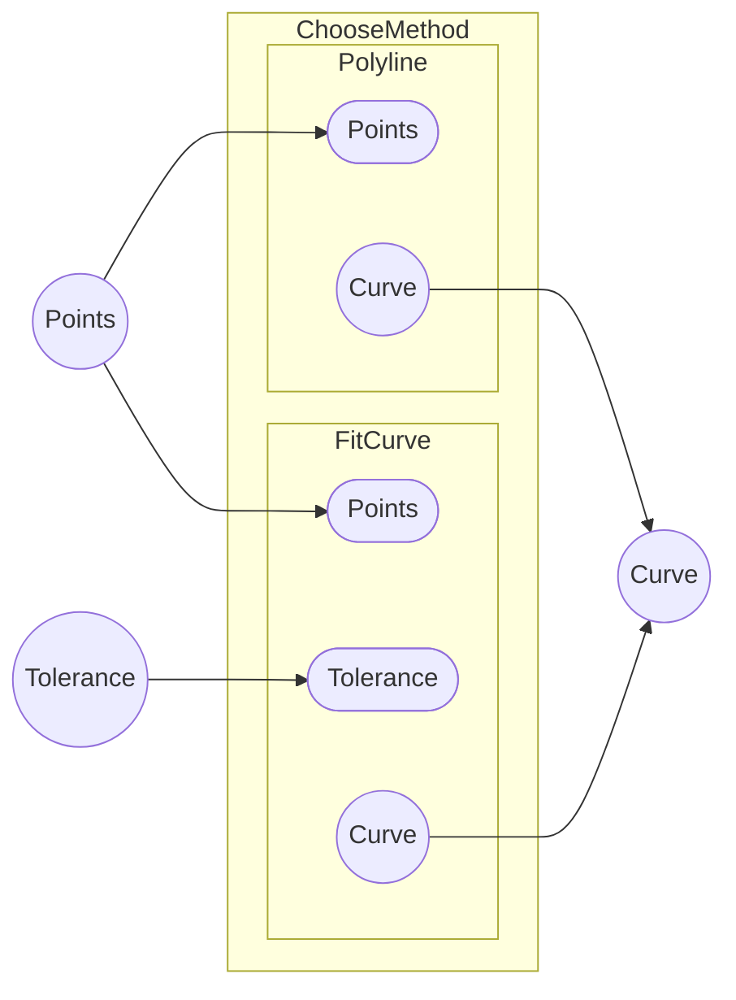

# Fit Curve（近似）とPolyline（折れ線）

Q: このページの目的は何ですか？

A: 本ページは `point-to-curve.md` の詳細解説として、ノイズを含むデータから曲線を推定する「Fit Curve（近似）」と、角を保持しながら点を結ぶ「Polyline（折れ線）」の使い分けと制御方法について解説します。

## Fit Curve（近似）：ノイズを含む点列の平滑化

Q: Fit Curveコンポーネントは、どのような仕組みで曲線を生成しますか？

A: 入力されたすべての点を通すのではなく、指定した **許容誤差（Tolerance）** の範囲内で、点列の全体的な傾向に最も近い滑らかな曲線を推定します。

- **保証事項**: 生成された曲線と各入力点との距離が、許容誤差以内に収まることを目標とします。
- **適用ケース**: 3Dスキャンデータや手書きのストロークなど、座標に微細なばらつき（ノイズ）が含まれており、そのまま補間すると「うねり」が生じてしまう場合に非常に有効です。
- **調整のコツ**: 
  - 許容誤差を小さく設定するほど元の点列に忠実になりますが、ノイズによるうねりも拾いやすくなります。
  - 許容誤差を大きく設定すると、より滑らかな曲線になりますが、元の形状からの乖離が大きくなります。

## Polyline（折れ線）：角の保持と明確な形状定義

Q: 意図的に「角」を残したまま点列を繋ぎたい場合は、どうすればよいですか？

A: **Polyline** コンポーネントを使用してください。

- **基本動作**: 各入力点を単純な直線セグメントで接続します。
- **利点**: アルゴリズムが極めて単純であるため、意図しない「膨らみ」や「うねり」が一切発生しません。
- **発展的な操作**: 
  - 全体を滑らかにするのではなく、特定の角だけを丸めたい場合は、Polylineを作成した後に `Fillet` や `Chamfer` コンポーネントを適用して局所的に調整するのが実務的なワークフローです。
  - 非常に高密度な点列に対してPolylineを適用すると、一見滑らかな曲線に見えますが、データ構造としては直線の集合であるため、後続のオフセット等の操作で計算負荷が高くなる場合があります。その場合は、一度 Polyline を作成してから `Fit Curve` でNURBS化することを検討してください。
