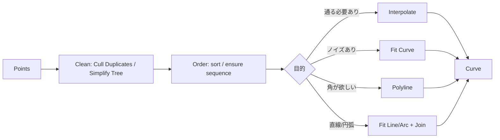

# 点列からCurveを作る（選定基準とアルゴリズムの要点）

## 基本方針

Q: このページの目的は何ですか？

A: Grasshopperでは、コンポーネントの選択によって結果が大きく変化します。本ページでは、**点列からCurveを生成する際の主要機能の仕組み（何を保証し、何を最適化しているか）**を、実務判断に必要な範囲で整理します。

- 目的: "暗記"ではなく、**選択理由**を説明できる状態にする
- 範囲: 実装の数式を網羅するのではなく、**挙動差が出る要点**に限定する
- **前提**: 本ページの説明は、Grasshopper標準コンポーネント（Rhino 7/8共通）を前提とします。プラグインコンポーネントの場合は明記します。

## 選定基準（用途別の第一候補）

Q: 点列を扱う際、すべての点を必ず通過させたい場合はどの手法を選べばよいですか？

A: **Interpolate（補間）**を使用します。指定したすべての点を通る滑らかなNURBS曲線が必要な場合に適しています。

Q: 測定データのようにノイズ（ばらつき）を含む点列から、滑らかな曲線を作りたい場合は？

A: **Fit Curve（近似）**を使用します。すべての点を通すのではなく、全体の傾向に合わせた「もっともらしい曲線」を生成します。許容誤差を調整することで、滑らかさと精度のバランスを制御できます。

Q: 補間（曲面化）せずに、入力点を結んだ折れ線を生成したい場合は？

A: **Polyline**を使用します。角を丸めず、入力された座標を直線で繋いだ形状（ポリライン）が必要な場合に適しています。

Q: 直線（LINE）と円弧（ARC）のみで構成されたセグメントで点列を再現したい場合は？

A: **Fit Line / Fit Arc** または **セグメント分割**を使用します。CAD/CAMでの加工（DXF出力など）において、直線・円弧の組み合わせが指定されている場合に推奨されます。

Q: 補間計算ではなく、制御点（Control Points）を直接配置してデザインしたい場合は？

A: **Nurbs Curve（Control Points入力）**を使用します。入力点が曲線上を通るのではなく、曲線を「引っ張る」重みとして機能する手法です。

## 事前に確定すべきこと

Q: 点列から曲線を作る前に確認すべきチェック項目はありますか？

A: 以下の3点を確認することで、生成後のトラブル（うねりや自己交差）を防ぐことができます：

- **点の意味**: すべての点を通過させる必要があるか（補間）／誤差内で近似できるか（近似）
- **点の品質**: 重複点の有無、座標のノイズ、およびリスト内の順序が正しいか。
- **欲しい曲線の性質**: 終端を閉じるか（Closed）、接線方向の制御が必要か、角を残す必要があるか。

## 詳細ページ

このページは概要（選定基準と安定化のための最小ワークフロー）に絞っています。詳細は以下のページを参照してください。

- Interpolate（補間）の詳細: [`point-to-curve-interpolate.md`](./point-to-curve-interpolate)
- 付録（NURBS補間の内部・制御点抽出）: [`point-to-curve-nurbs-interpolation-notes.md`](./point-to-curve-nurbs-interpolation-notes)
- Fit Curve / Polyline: [`point-to-curve-fit-polyline.md`](./point-to-curve-fit-polyline)
- 直線・円弧（LINE/ARC）・DXF: [`point-to-curve-line-arc-dxf.md`](./point-to-curve-line-arc-dxf)

## 典型ワークフロー（点列→Curveを安定させる）

Q: Grasshopperで等間隔な数列（linspace相当）を生成し、点列の基礎を作るには？

A: 目的に応じて、以下のコンポーネントを使い分けます。

- **linspace相当（開始〜終了をN分割）**: `Range`
  - 入力: `Domain`（開始〜終了）, `Steps`（分割数）
  - 出力: 端点を含む等間隔な数値リスト。
- **一定ステップの数列（開始, 開始+増分, …）**: `Series`
  - 入力: `Start`（開始）, `Step`（増分）, `Count`（個数）

## よくある失敗と対策

Q: 点の順序が不適切な場合、どのような問題が起き、どう対処すべきですか？

A: 曲線が自己交差したり、激しく蛇行したりします。対策として、点の生成順を明示的に管理するか、`Sort Along Curve` などのソート工程を定義内に含めてください。

Q: 重複点や過密な点がある場合、曲線にどのような影響がありますか？

A: 局所的に曲率が急増し、レンダリングやオフセット時に不具合が生じます。`Cull Duplicates` で重複を除去するか、必要に応じて最小間隔で間引き（Downsampling）を行ってください。

Q: ノイズが含まれる点列に `Interpolate` を適用するとどうなりますか？

A: 曲線が細かく波打つ「不要な振動」が発生します。対策として、`Fit Curve`（近似）に切り替えるか、入力点列を平滑化してから補間を適用してください。

Q: Data Tree構造によって意図しない曲線が生成される場合の考え方は？

A: `Simplify` や `Flatten` などでTreeの階層を整理してください。基本的には「1つのリストから1つの曲線を作る」状態になっているかを常に確認します。
