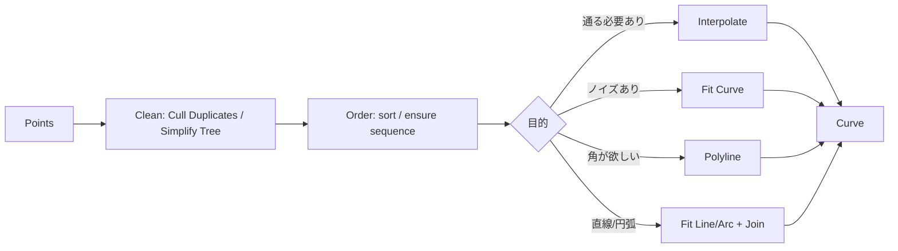

# 点列からCurveを作る（選定基準とアルゴリズムの要点）

## 基本方針

**Q: このページの目的は？**

A: Grasshopperでは、コンポーネントの選択によって結果が大きく変化します。本ページでは、**点列からCurveを生成する際の主要機能の仕組み（何を保証し、何を最適化しているか）**を、実務判断に必要な範囲で整理します。

- 目的: "暗記"ではなく、**選択理由**を説明できる状態にする
- 範囲: 実装の数式を網羅するのではなく、**挙動差が出る要点**に限定する
- **前提**: 本ページの説明は、Grasshopper標準コンポーネント（Rhino 7/8共通）を前提とします。プラグインコンポーネントの場合は明記します。

## 選定基準（用途別の第一候補）

**Q: 点が「必ず通過すべき条件」の場合は？**

A: **Interpolate（補間）**を使用します。

**Q: 点が測定/スキャン等でノイズを含む場合は？**

A: **Fit Curve（近似）**を使用します。ノイズが含まれていてもっともらしい曲線が欲しい場合に推奨します。許容誤差を調整することで、滑らかさと精度のバランスを制御できます。

**Q: 折れ線が欲しい（角を残したい）場合は？**

A: **Polyline**を使用します。

**Q: LINE（直線）とARC（円弧）で構成された幾何学セグメントで点列を再現したい場合は？**

A: **Fit Line / Fit Arc / セグメント分割**を使用します。CAD/CAMで扱いやすい形式（直線・円弧の組み合わせ）が必要な場合に推奨します。

**Q: 「制御点（Control Points）を直接いじる」設計にしたい場合は？**

A: **Nurbs Curve（Control Points入力）**を使用します。

## 事前に確定すべきこと

**Q: 点列から曲線を作る前に確認すべきことは？**

A: 以下の3点を確認します：

- **点の意味**: すべての点を通過させる必要があるか（補間）／誤差内で近似できるか（近似）
- **点の品質**: ノイズ（ばらつき）の有無、重複点の有無、順序の正しさ
- **欲しい曲線の性質**: 角を残す/滑らかにする、閉じる/開く、接線条件が必要か

## 詳細（分割）

このページは概要（選定基準と安定化のための最小ワークフロー）に絞っています。詳細は以下のページに分割しました。

- Interpolate（補間）の詳細: [`point-to-curve-interpolate.md`](./point-to-curve-interpolate)
- 付録（NURBS補間の内部・制御点抽出）: [`point-to-curve-nurbs-interpolation-notes.md`](./point-to-curve-nurbs-interpolation-notes)
- Fit Curve / Polyline: [`point-to-curve-fit-polyline.md`](./point-to-curve-fit-polyline)
- 直線・円弧（LINE/ARC）・DXF: [`point-to-curve-line-arc-dxf.md`](./point-to-curve-line-arc-dxf)

## 典型ワークフロー（点列→Curveを安定させる）

点列から曲線を生成する際の基本フローを示します。

**Q: linspaceみたいに等間隔の連番を出す方法は？（Grasshopper）**

A: 目的に応じて次を使い分けます。

- **linspace相当（開始〜終了を等間隔にN分割）**: `Range`
  - 入力: `Domain`（開始〜終了）, `Steps`（分割数）
  - 出力: 端点を含む等間隔リスト（linspaceに相当）
  - Domainは `Construct Domain` で作るのが定番です
- **一定ステップの数列（start, start+step, …）**: `Series`
  - 入力: `Start`（開始）, `Step`（増分）, `Count`（個数）

## よくある失敗とチェックリスト

**Q: 点の順序が不適切な場合の症状と対策は？**

A: 自己交差・蛇行が発生します。対策として、点列の順序を作る工程を定義内に明示し、暗黙にListへ投入しないようにします。

**Q: 重複点／過密点が混在する場合の症状と対策は？**

A: 局所で曲率が増大します。対策として、重複除去、最小間隔の確保（必要に応じて間引き）を行います。

**Q: ノイズ点に対してInterpolateを適用した場合の症状と対策は？**

A: 不要な振動が発生します。対策として、`Fit Curve` へ切り替える（推奨）、または点列を平滑化してから補間します。`Fit Curve`を使用する場合、ノイズの大きさを推定して適切な許容誤差を設定します。

**Q: Data Tree構造の影響で意図しない曲線が複数生成される場合の対策は？**

A: `Simplify` / `Flatten` / `Graft` の方針を先に決め、後段で辻褄合わせをしないようにします。
