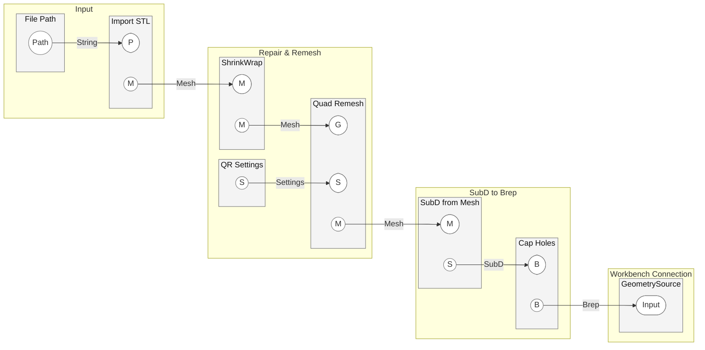

# Example 06: STLからSTEPへの変換（ANSYS Workbench連携）

STLメッシュファイルをANSYS解析用のSTEPジオメトリに変換し、WorkbenchExecutorに渡すためのワークフローを解説します。

## 概要

この例では、STLファイル（3Dスキャン、トポロジー最適化結果など）をGrasshopper上でソリッドBrep（STEP出力可能なB-Rep形状）に変換し、WorkbenchExecutorの通常のワークフローに接続する方法を説明します。

STLは三角形メッシュであり、ANSYSが期待するソリッドジオメトリ（STEP）とはデータ構造が根本的に異なります。直接STEPに変換すると面数が膨大になり、解析ソフトでのインポートやメッシュ生成が困難になるため、以下のパイプラインで段階的に変換します。

```
STL → ShrinkWrap → QuadRemesh → SubD from Mesh → Brep → GeometrySource
```

## 前提条件

- **Rhino 8** 以降（ShrinkWrapコンポーネントが必要）
- Grasshopper
- WorkbenchExecutorプラグイン
- Ansys Workbench 2024R2 / 2025 R1以降
- 入力となるSTLファイル

---

## 基本概念とワークフロー

### Q: なぜSTLを直接STEPに変換してはいけないのですか？

A: STLの三角形面をそのままSTEPの面に変換すると、面数が数万〜数十万に達し、ANSYS側でのインポートが極めて低速になるか、失敗するためです。
本ワークフローでは、**QuadRemesh**と**SubD**を介することで、形状の滑らかさを保ちつつ、面数を数百〜数千程度まで劇的に削減します。これにより、ANSYS側でのメッシュ生成が安定し、計算コストも抑えられます。

### Q: 各ステップの役割と重要なパラメータは何ですか？

A: 以下の5つのステップで構成されます。

#### 1. STLの読み込みとShrinkWrap（穴修復）
元のSTLに穴やギャップがあると、最終的に「Open Brep（中空ではない面）」になり、ANSYSでソリッドとして認識されません。**ShrinkWrap**で強制的に閉じた（Closed）メッシュを生成します。

- **重要パラメータ**:
  - **Fill Holes**: `True`（必須。穴を完全に塞ぐ）
  - **Offset**: `0`（元形状を維持）
  - **Target Edge Length**: 元のメッシュ密度と同等か、やや大きめに設定

#### 2. QuadRemesh（面数制御）
三角形メッシュを四角形（Quad）メッシュに変換します。ここがSTEPの面数を決定する最も重要な工程です。

- **重要パラメータ**:
  - **Target Quad Count**: `100`〜`300`を推奨。形状が崩れない範囲で最小値を狙います。
  - **Adaptive Size**: `0`（均一な面分割）にすると、不要な細分化を防げます。

#### 3. SubD from Mesh（滑らかな曲面化）
QuadメッシュをSubD（サブディビジョンサーフェス）に変換し、カクカクしたメッシュを滑らかなジオメトリに変えます。

- **重要パラメータ**:
  - **Edge Crease (C)**: `2`（外周エッジをシャープに保つ）
  - **Interpolate (I)**: `False`（推奨。FEA用途ではこちらのほうが曲面が安定します）

#### 4. Brepへのキャストと検証
SubDの出力をBrep入力端子に接続すると、自動的にBrepに変換されます。

- **検証方法**:
  - **Brep Is Solid**コンポーネントを接続し、`True`であることを確認してください。`False`の場合は、ステップ1のShrinkWrapの設定を見直す必要があります。

#### 5. GeometrySourceへの接続
検証済みのBrepを**GeometrySource**に接続し、以降は通常の[Example 01](./01_simple_workbench_project.md)と同様のフローに合流させます。

---

## GH定義の配線図

Q: 具体的なコンポーネントの接続構成はどうなりますか？

A: 以下のMermaid図に、推奨される最小構成の配線を示します。



---

## トラブルシューティング

### Q: Brep Is Solid が False（Open Brepになる）場合の対処は？

A: 主な原因は元のSTLの不備か、ShrinkWrapのパラメータ不足です。
1. **ShrinkWrapのFill Holes**が`True`になっているか再確認してください。
2. **Target Edge Length**を小さくして、解像度を上げてください。
3. 最後に**Cap Holes**コンポーネントを通すことで、微小な平面の穴が埋まる場合があります。

### Q: STEPの面数が多すぎてANSYSが重い場合は？

A: **QuadRemeshのTarget Quad Count**を減らすのが最も効果的です。
1. `100`〜`200`程度まで下げてみてください。
2. **Adaptive Size**を`0`に設定し、曲率の強い場所以外での不要な分割を抑制します。
3. Brep変換後に**Merge Faces**コンポーネント（Surface > Util）を使用して、同一平面上の面を統合してください。

## 関連リンク

- [Example 01: 新規Workbenchプロジェクトの作成](./01_simple_workbench_project.md)
- [Example 03: 静的構造解析のジオメトリ変更](./03_change_geometry_static_structural.md)
- [STL → STEP 変換ベストプラクティス](../docs/stl_to_step_best_practice.md)
