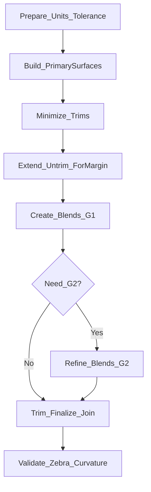

# サーフェスモデリングのフィレット/ブレンド手順（推奨順序）

Q: このページの目的は？

A: CNC/金型/解析前提で、Rhinoの自由曲面に対して「CADなら最後に一括フィレット」をやりたくなる場面を、**失敗しない順序（一次面→ブレンド→最終トリム/Join）**に置き換えます。狙いは「一回で通す」ではなく、**戻り先が明確で再現性が高い**手順にすることです。

> 前提:
> - Rhino 7/8 を想定します。
> - 主対象は NURBS/Brep（サーフェス/ソリッド）です。

## まず方針：エッジフィレットを“最後に足す”のを基本にしない

Q: なぜ「最後に一括フィレット」が危ないのですか？

A: 自由曲面では、最後にエッジへ一括で処理すると、**微小面の増殖**や**トリムの複雑化**で面品質が悪化し、修正が難しくなりがちです。先に“面の流れ”を作り、最後は **Blend/Matchで仕上げ**る方が安定します。

## 推奨シーケンス（基本形）

Q: 推奨の順序は？

A: 迷ったら次の順で進めます。

### 0) 前提の固定（失敗率を下げる）

Q: 最初に固定すべきことは？

A: 単位と公差が揃っていないと、Intersect/Joinが崩れて以降が全部不安定になります。

- 参照: [単位・公差・メッシュ健全性（製造に入る前のチェック）](/rhino/units-tolerance-and-mesh-health)

### 1) 一次面（Primary Surfaces）を作る

Q: 一次面とは？

A: ブレンドやフィレットの“受け”になる主面です。ここが綺麗だと、仕上げ面も綺麗になります。

ポイント:
- まず面の流れを決める（断面/レールの設計を優先）
- 必要なら曲線を整流（Rebuild/Fit等）して曲率の暴れを抑える

### 2) トリムを最小化する（後工程の地雷を減らす）

Q: トリムが多いと何が困る？

A: 小面や短いエッジが増え、フィレット/面取り系コマンドが落ちやすく、面品質も崩れやすくなります。

方針:
- “先に切って合わせる”より、“先に面を成立させて最後に切る”に寄せる

### 3) 延長・未トリム面で「余白」を作る

Q: ブレンドを作る前に延長が必要なのはなぜ？

A: G1/G2の仕上げ面は、境界のすぐ近くではなく**一定の幅**を使って滑らかさを作ります。面が短いと、その幅が確保できず破綻します。

### 4) まずG1のブレンドを成立させる（基本の完成形）

Q: まずG1が目標なのはなぜ？

A: CNC/金型で“折れ”が出る主因はG1不足なので、まずG1でハイライトの折れを消すのが最短で効果が出ます。

使い分け（目安）:
- 既存面を合わせたい: `MatchSrf`（G1）
- 間に仕上げ面を作りたい: `BlendSrf`（G1）

### 5) 必要部位だけG2へ（全域で狙わない）

Q: どこでG2を狙う？

A: 高光沢で視線が走る大面積、研磨/塗装でムラが目立つ箇所など、**目立つ部位だけ**です。全域G2は工数とリスクが跳ねます。

### 6) 最後にトリム/Joinして仕上げる

Q: 仕上げの合否判定は？

A: 仕上げ面を作ったら、最後は可視化で“症状が消えているか”を確認します。

- `Zebra` / `EnvironmentMap` / `CurvatureAnalysis`
- 参照: [G0/G1/G2連続の実務](/rhino/g1-g2-continuity-practical)

## 失敗したときの戻り先（最短）

Q: ブレンドが汚い/通らないとき、どこに戻るべきですか？

A: “最後のコマンド”を疑う前に、次の順で戻ると早いです。

1. **余白不足**: 面が短い／トリム境界が近い → 一次面・延長へ戻る
2. **曲線が汚い**: 断面/レールの曲率が暴れている → 曲線整流へ戻る
3. **トリムが過剰**: 小面が増殖している → 面構成の整理へ戻る
4. **前提崩れ**: 公差/単位が怪しい → 前提ページに戻る

## Grasshopperでの扱い（比較）

Q: GHでこの順序を再現するには？

A: GHは「一次面の骨格（断面/レール/基準）」を作るのに強いです。一方、CNC/金型の仕上げ品質（G2相当）まで追い込む部分は試行錯誤になりやすいので、最終合否はRhinoの解析表示で行うのが安定です。

## 次に読む

- なぜRhinoはフィレット/面取りが難しくなるか（CAD比較）: [フィレット/面取り：なぜRhinoは難しくなるか（CAD比較）](/rhino/fillet-and-chamfer-why-hard)
- 連続性の症状→検査→修正: [G0/G1/G2連続の実務](/rhino/g1-g2-continuity-practical)
