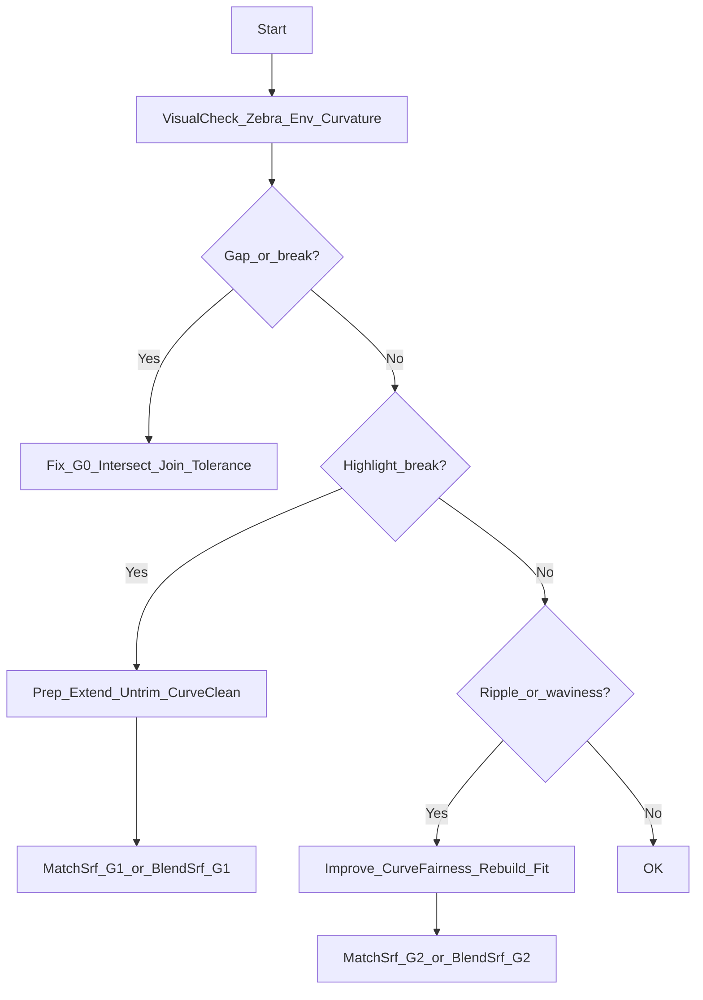

# G0/G1/G2連続の実務：症状→検査→修正（CNC/金型/解析向け）

Q: このページの目的は？

A: 「G0/G1/G2」を用語で終わらせず、**CNC/金型/解析で問題になる“見え方/当たり”**を基準に、Rhinoでの **検査（可視化）→原因の切り分け→修正** を最短で回せるように整理します。

> 前提:
> - 断りがない限り Rhino 7/8 を想定します。
> - ここで扱う主対象は **NURBS/Brep（サーフェス/ソリッド）** です（SubDは `ToNURBS` 後に評価するのが安定です）。

## まず結論：CNC/金型で“どこまで必要か”

Q: CNC/金型/解析で、G0/G1/G2はどこまで必要ですか？

A: 目的で優先度が変わります。迷ったら **「まずG1を成立させ、必要部位だけG2を狙う」**が安全です。

| 連続性 | 何が揃っているか | 現場での症状 | まずの目標 |
| --- | --- | --- | --- |
| **G0（位置連続）** | 隙間がない | 研磨以前に“段差/欠け/隙間”になる | 必須 |
| **G1（接線連続）** | 接線方向が揃う | ハイライトが折れる、当たりが出る | 高優先 |
| **G2（曲率連続）** | 曲率の変化が滑らか | ハイライトが“うねる”、高光沢でムラ | 条件次第 |

## 症状から入る：よくある“見え方”の違和感

Q: 「G1が足りない」典型的な見え方は？

A: `Zebra` や `EnvironmentMap` で **線が“折れる/角が立つ”** ように見えます。研磨後・塗装後に目立ちやすいです。

Q: 「G2が足りない」典型的な見え方は？

A: 線は繋がって見えるが、**線の間隔や流れが急に変わる（うねり/ムラ）**ように見えます。高光沢・大きな曲面で出やすいです。

## 検査（可視化）：最短の3点セット

Q: Rhinoで連続性を“手早く”見るには？

A: まずは次の3つで十分です（いきなり数値評価より、症状の可視化が速いです）。

- `Zebra`: ハイライトの連続性（折れ/うねりの検出）
- `EnvironmentMap`: 反射環境での見え方（全体のムラ検出）
- `CurvatureAnalysis`: 曲率の偏り（ムラ/急変の検出）

> 関連: 既存の合否判定の入口は [品質チェック（連続性・面品質・水密性）](/rhino/quality-checks-continuity-surface-watertight) を参照してください。

## 原因の切り分け：まず疑うべき“前提崩れ”

Q: 連続性を作る前に、まず揃えるべき前提は？

A: **フィレットやブレンドを“後付け”できるCAD的発想**がうまくいかないときは、だいたい次の前提が崩れています。

1. **未トリム面が足りない**: トリム境界が近すぎて、滑らかに繋ぐ“余白”がない
2. **面の延長不足**: 交線周りで面が短く、ブレンド領域が確保できない
3. **曲線が汚い**: 断面/レールの曲率が暴れていて、面の曲率も暴れる
4. **公差が合っていない**: Join/Intersectが不安定で、以降が全部ズレる

> 公差と単位の前提は [単位・公差・メッシュ健全性](/rhino/units-tolerance-and-mesh-health) を参照してください。

## 修正（Rhino）：基本の2系統（Match vs Blend）

Q: G1/G2を作るとき、`MatchSrf` と `BlendSrf` はどう使い分けますか？

A: ざっくり次の方針です（形状と要求で逆転もあり得ます）。

- **`MatchSrf`**: 既存の面を「指定連続性で一致」させたいとき（面構成を維持しやすい）
- **`BlendSrf`**: 2つの境界を「間に滑らかな面を新規生成」したいとき（仕上げ面として使いやすい）

Q: “CADなら一発”に近い結果を出すには、どこを先に直すべきですか？

A: ブレンド/マッチを当てる前に、まず **「面の余白（延長）」「曲線の整流」** を先にやるのが近道です。ブレンドは魔法ではなく、入力が汚いと出力も汚くなります。

## ワークフロー（最短の戻り先つき）

Q: 連続性が出ないときの、最短の戻り方は？

A: 迷うのを避けるため、次の順で原因を潰します。

## Grasshopperでの扱い（比較）

Q: GrasshopperでG1/G2品質まで作り込めますか？

A: できますが、CNC/金型/解析レベルの仕上げ面では、次の理由で **最終調整はRhino側（解析ツール併用）が安定**です。

- GHは“手順の再現”は得意だが、ブレンドの微調整は形状依存で試行錯誤になりやすい
- トリムや交線の更新で、下流が壊れやすい（設計基準の持ち方が重要）

方針としては、GHは **基準（断面・レール・交線）を作る**役に寄せ、面品質の合否はRhinoの `Zebra` 等で必ず確認してください。

## 次に読む

- フィレット/面取りを「CADなら一発」感覚でやると躓く理由: [フィレット/面取り：なぜRhinoは難しくなるか（CAD比較）](/rhino/fillet-and-chamfer-why-hard)
- 面構成から“最後にブレンドで仕上げる”手順: [サーフェスモデリングのフィレット/ブレンド手順（推奨順序）](/rhino/fillet-workflow-for-surface-modeling)
